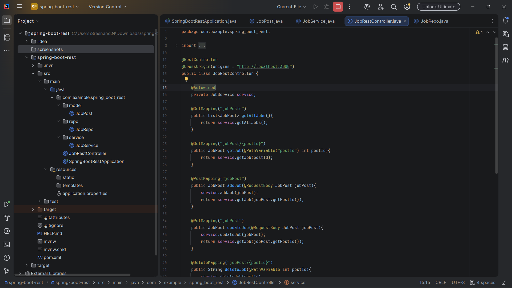
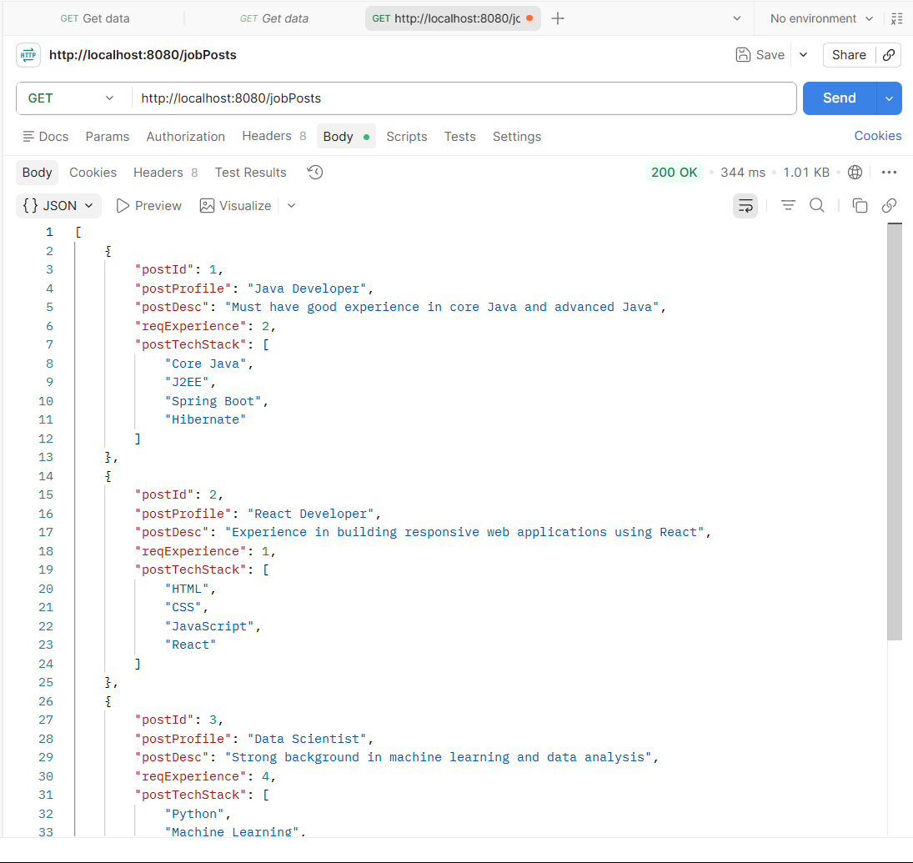

# Spring Boot REST API - Job Portal

A Spring Boot REST API project built to understand the fundamentals of RESTful web services and layered architecture.

This project exposes CRUD endpoints for managing job postings and returns data in JSON format. The application follows a Controller → Service → Repository architecture and was tested using Postman.

## Features

* Retrieve all job postings
* Retrieve a job posting by ID
* Add a new job posting
* Update an existing job posting
* Delete a job posting
* Return JSON responses using REST APIs
* Layered architecture (Controller, Service, Repository)

## Technologies Used

* Java
* Spring Boot
* Spring Web
* Lombok
* Maven
* Postman

## Project Structure

```text
spring-boot-rest
│
├── src
│   ├── main
│   │   ├── java
│   │   │   └── com.example.spring_boot_rest
│   │   │       ├── model
│   │   │       │   └── JobPost.java
│   │   │       │
│   │   │       ├── repo
│   │   │       │   └── JobRepo.java
│   │   │       │
│   │   │       ├── service
│   │   │       │   └── JobService.java
│   │   │       │
│   │   │       ├── JobRestController.java
│   │   │       └── SpringBootRestApplication.java
│   │   │
│   │   └── resources
│   │       └── application.properties
│   │
│   └── test
│
├── screenshots
│   ├── project-structure.png
│   └── get-jobposts-response.png
│
├── pom.xml
├── mvnw
├── mvnw.cmd
└── README.md
```


## API Endpoints

### Get All Jobs

```http
GET /jobPosts
```

### Get Job By ID

```http
GET /jobPost/{postId}
```

Example:

```http
GET /jobPost/1
```

### Add New Job

```http
POST /jobPost
```

Request Body:

```json
{
  "postId": 6,
  "postProfile": "Python Developer",
  "postDesc": "Experience in Django and REST APIs",
  "reqExperience": 2,
  "postTechStack": [
    "Python",
    "Django",
    "REST API"
  ]
}
```

### Update Existing Job

```http
PUT /jobPost
```

### Delete Job

```http
DELETE /jobPost/{postId}
```

Example:

```http
DELETE /jobPost/6
```

## Sample JSON Response

```json
[
  {
    "postId": 1,
    "postProfile": "Java Developer",
    "postDesc": "Must have good experience in core Java and advanced Java",
    "reqExperience": 2,
    "postTechStack": [
      "Core Java",
      "J2EE",
      "Spring Boot",
      "Hibernate"
    ]
  }
]
```

## Key Concepts Learned

* REST API fundamentals
* HTTP Methods (GET, POST, PUT, DELETE)
* JSON request and response handling
* @RestController
* @RequestBody
* @PathVariable
* Dependency Injection using @Autowired
* Layered Architecture
* Cross-Origin Resource Sharing (CORS)

## Testing

The API endpoints were tested using Postman to verify CRUD operations and JSON responses.

## Screenshots

### Project Structure



### GET /jobPosts Response



